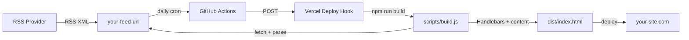

# lean-rss-feed-website

A writing-first personal website powered by any RSS feed. Also easy to add your selected projects to it.

Fork it, set your RSS URL, deploy. Made for those willing to spend time building content, projects, and an audience, and not figuring out complex frontend frameworks.



## How it works

- A build script fetches any RSS feed and parses it into posts
- Handlebars renders the template with your content (bio, work, posts)
- Output is a single `index.html` -- no server, no database
- GitHub Actions runs daily, triggers a Vercel redeploy, picks up new posts

## Quick start

```bash
npm install
npm run build
open dist/index.html
```

## Configure

Copy `data/content.example.json` to `data/content.json` and edit it:
- Set `rss.url` to your RSS feed URL
- Set `rss.fallbackPosts` as placeholder content when the feed is unavailable
- Edit `site`, `about`, `work` with your info

`data/content.json` is gitignored -- your personal data stays out of the repo.

The RSS parser currently expects Substack-style XML. If your feed uses different elements, adjust `scripts/build.js` to match.

## Deploy

Connect this repo to Vercel. The daily cron keeps your site in sync with your RSS source.

## Tech

Node.js, Handlebars, RSS, vanilla CSS. One page.
